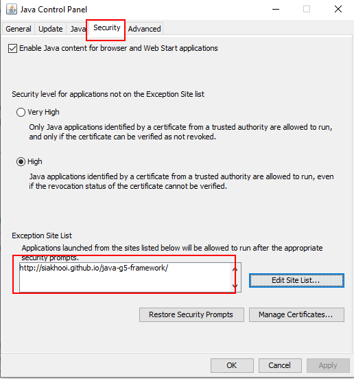
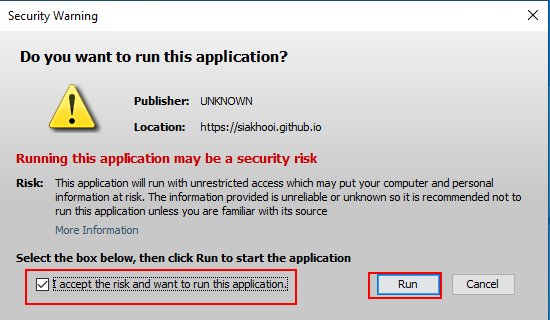
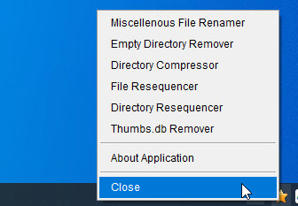

# Prototypes

- The following are prototype applications to demo
  - What type of applications G5 Java Application Framework can be used to build.
  - What capabilities the framework provide.
- The database used in the prototypes is HSQLDB.

## List of Prototypes

| Prototype                               | Description                                                                                                         |
| --------------------------------------- | ------------------------------------------------------------------------------------------------------------------- |
| [Personal Finance Assistant](/pfa.jnlp) | application to track personal finance, with reports such personal Balance sheets & Profit & Lost Statements.        |
| [Utilities](/ut.jnlp)                   | Desktop Utilities software that run at the system tray to do file operations. (See [screen shot](#utilities) below) |
| [BizSuite](/bs.jnlp)                    | Business application - Sales and Purchases                                                                          |
| [Inventory Suite](/is.jnlp)             | Business application - Inventory management                                                                         |
| [Demo Toolkit](/demo.jnlp)              | Demo of all forms available in G5 Java Application Framework                                                        |

## How to Run Demo

### Requirements

- You need Java Web Start to be installed.

### Setup

- The prototypes are signed with self generated CA for demo purposes. There are 2 ways to run the prototypes:

  - install the self generated Root CA located at: <https://siakhooi.github.io/ca/> (**Recommended**), or
  - Configure your system to bypass the security.

#### Configure to bypass the security

- Control Panel > Java > Security Tab > Exception Site List - add `https://siakhooi.github.io/java-g5-framework/`
  

### How to run

- click on the Link above, eg: [PFA - Personal Finance Assistant](/pfa.jnlp)
- Your browser will download a jnlp file, double click on the file should trigger Java Web Start.
  - Java Web Start will give a Security Warning. Check on 'I accept...' and click 'Run'. (See screen shot below)
  - Java Web Start will download all required libraries and start the program.

## Utilities {#utilities}

